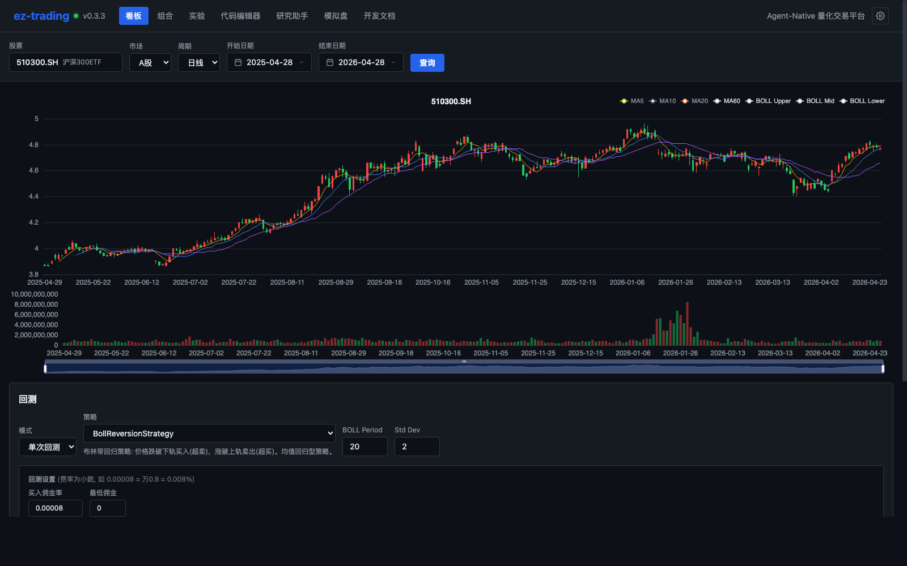

# OpenTrading

开源量化交易研究平台。下载项目、启动服务，然后在浏览器里完成行情查看、策略回测、因子研究、组合回测和模拟盘管理。




---

## 核心功能

- **策略回测** — 支持单股/组合两种模式，完整实现 A 股市场规则：T+1、涨跌停、印花税
- **因子研究** — 截面 IC/RankIC/ICIR/衰减分析/分组收益，内置相关性矩阵与多因子对比
- **组合优化** — 均值方差、风险平价、最小方差等多种优化器，配合 Brinson 归因分析
- **参数搜索** — Walk-forward 验证结合 Bootstrap 显著性检验，有效识别过拟合策略
- **AI 助手** — LLM 编程助手辅助对话式策略开发，支持自主研究任务
- **模拟实盘** — 完整的部署门控、调度器、OMS 事件溯源，原生对接 QMT 券商接口
- **MLAlpha** — 9 种估计器（Ridge/Lasso/RandomForest/XGBoost 等），自动过拟合诊断
- **全流程 UI** — 所有操作均可在浏览器中完成，无需本地编程环境

---

## 快速开始

### 本地启动

```bash
git clone https://github.com/JayCheng113/OpenTrading.git
cd OpenTrading

# 安装后端依赖
pip install -e ".[all]"

# 安装前端依赖
cd web && npm install && cd ..

# 启动后端和前端
scripts/start.sh
```

浏览器访问 `http://localhost:3000`。

> 没有数据源 Token 也可以先试用内置 ETF 样例数据，例如搜索 `510300.SH`。如需完整 A 股行情和基本面数据，再配置 `TUSHARE_TOKEN`。

### 单服务模式

```bash
cd web && npm install && npm run build && cd ..
uvicorn ez.api.app:app --host 0.0.0.0 --port 8000
```

浏览器访问 `http://localhost:8000`。

### Docker（可选）

```bash
docker compose up --build
```

Docker 配置用于容器化部署和快速试跑；本地开发建议优先使用上面的本地启动方式。

---

## 功能展示

### 策略编辑与回测

在浏览器中直接编写策略代码，实时运行回测并查看净值曲线、Sharpe 比率、最大回撤等完整指标。支持 Walk-forward 验证和显著性检验，有效识别过拟合策略。

### 因子研究面板

内置多种技术与基本面因子，支持截面 IC/RankIC/ICIR 计算、因子衰减分析、分组收益回测，以及多因子相关性矩阵分析。

### 组合回测

支持多标的轮动回测，提供均值方差、风险平价等多种组合优化方式，配合 Brinson 归因精确拆解超额收益来源。

### AI 研究助手

基于 LLM 的对话式策略开发助手，支持自然语言描述策略需求，自动生成并验证代码；自主研究模式可端到端完成因子挖掘与回测任务。

### 模拟实盘

完整的模拟实盘环境，包括部署门控、定时调度、OMS 事件溯源与回放，支持 QMT 券商实单接口（白名单小额实盘）。

---

## 环境变量

| 变量名 | 必填 | 说明 |
|--------|------|------|
| `TUSHARE_TOKEN` | 否 | Tushare 数据接口 Token，用于获取完整 A 股行情与财务数据 |
| `DEEPSEEK_API_KEY` | 否 | DeepSeek LLM API Key，用于 AI 助手与自主研究功能 |
| `FMP_API_KEY` | 否 | Financial Modeling Prep API Key，用于部分基本面数据 |

---

## 文档与贡献

- [快速上手](docs/guide/quick-start.md)：完成第一次策略回测
- [安装指南](docs/guide/installation.md)：依赖安装、环境变量和数据缓存
- [功能总览](docs/guide/features.md)：了解各个页面能做什么
- [贡献指南](CONTRIBUTING.md)：本地开发、测试和 PR 流程
- [更新日志](CHANGELOG.md)：查看版本变化

---

## 免责声明

OpenTrading 仅用于量化研究、教学和工具开发，不构成任何投资建议。回测结果不代表未来收益，实盘交易请自行评估风险。

---

## License

本项目以 [MIT 协议](LICENSE) 开源，欢迎自由使用与二次开发。
